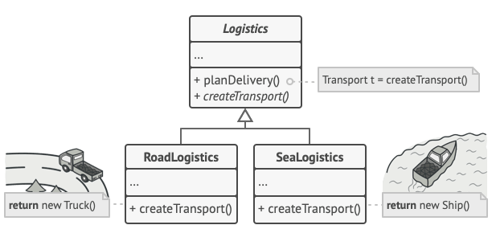
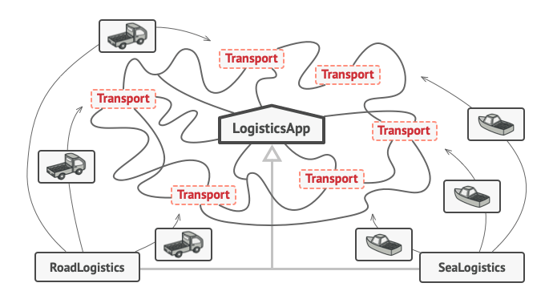
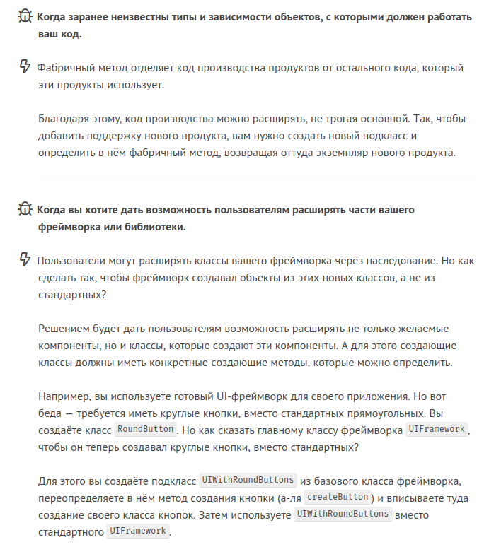
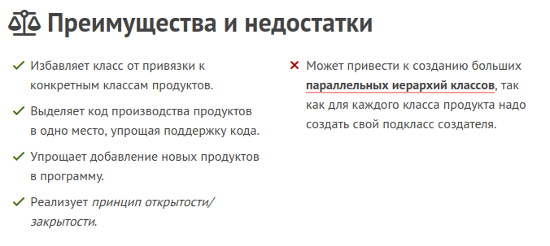
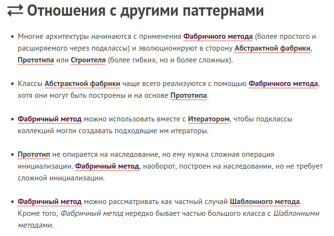

## Фабричный метод
Это порождающий паттерн проектирования, который определяет
общий интерфейс для создания объектов в суперклассе, позволяя подклассам
изменять тип создаваемых объектов.

## Проблема
Представьте, что вы создаёте программу управления грузовыми перевозками. Сперва вы рассчитываете перевозить 
товары только на автомобилях. Поэтому весь ваш код работает с объектами класса `Грузовик`.
В какой-то момент ваша программа становится настолько известной, что морские перевозчики выстраиваются в очередь 
и просят добавить поддержку морской логистики в программу. Отличные новости, правда?! Но как насчёт кода? 
Большая часть существующего кода жёстко привязана к классам Грузовиков. Чтобы добавить в программу классы морских 
Судов, понадобится перелопатить всю программу. Более того, если вы потом решите добавить в программу ещё один 
вид транспорта, то всю эту работу придётся повторить. В итоге вы получите ужасающий код, наполненный условными 
операторами, которые выполняют то или иное действие, в зависимости от класса транспорта.

## Решение
Паттерн Фабричный метод предлагает создавать объекты не напрямую, используя оператор new, а через вызов особого 
фабричного метода. Не пугайтесь, объекты всё равно будут создаваться при помощи new, но делать это будет 
фабричный метод.

На первый взгляд, это может показаться бессмысленным: мы просто переместили вызов конструктора из одного конца программы 
в другой. Но теперь вы сможете переопределить фабричный метод в подклассе, чтобы изменить тип создаваемого продукта.

Чтобы эта система заработала, все возвращаемые объекты должны иметь общий интерфейс. Подклассы смогут производить 
объекты различных классов, следующих одному и тому же интерфейсу.

Например, классы `Грузовик` и `Судно` реализуют интерфейс `Транспорт` с методом `доставить`. Каждый из этих классов 
реализует метод по-своему: грузовики везут грузы по земле, а суда — по морю. Фабричный метод в классе `ДорожнойЛогистики` 
вернёт объект `грузовик`, а класс `МорскойЛогистики` — объект `судно`.

Для клиента фабричного метода нет разницы между этими объектами, так как он будет трактовать их как некий абстрактный
`Транспорт`. Для него будет важно, чтобы объект имел метод доставить, а как конкретно он работает — не важно.

## Структура

## Применимость

## Шаги реализации

## Преимущества и недостатки

## Отношения с другими паттернами

